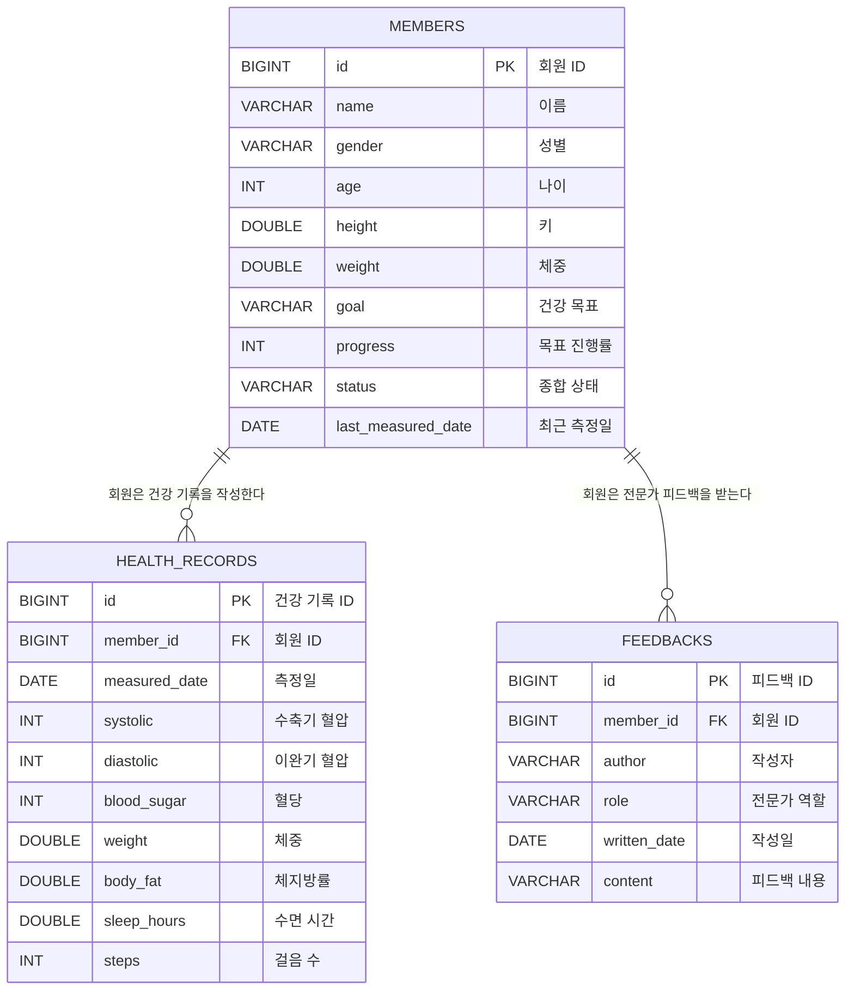

# Fitness Medical ERD

## 관계 해석

### MEMBERS → HEALTH_RECORDS

`1:N` 관계입니다. 한 회원에게 건강 기록이 여러 개 존재할 수 있지만, 건강 기록 하나는 한 명의 회원에게만 속합니다.

### MEMBERS → FEEDBACKS

`1:N` 관계입니다. 한 회원은 여러 피드백을 받을 수 있지만, 피드백 하나는 한 명의 회원에게만 연결됩니다.

## 향후 추가할 테이블

다음 기능을 직접 구현할 때 ERD에 추가합니다.

- `users`: 로그인 계정
- `professionals`: 의료 전문가와 트레이너 정보
- `goals`: 회원별 건강 목표
- `appointments`: 회원과 전문가 예약
- `professional_members`: 전문가와 담당 회원의 연결

MongoDB의 RAG 문서는 관계형 테이블이 아니므로 이 ERD와 분리해서 관리합니다.
